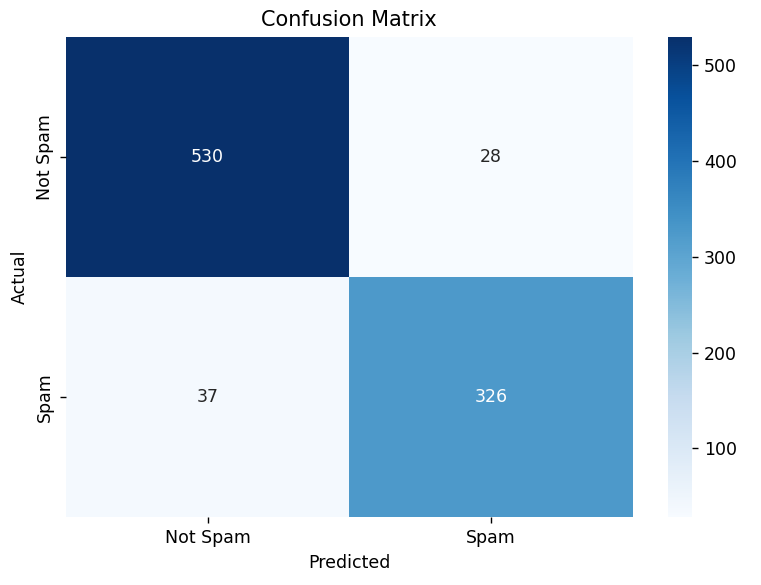

# Spam Email Detector 📧  
***A machine learning project that detects whether an email is **Spam** or **Not Spam**.  
It uses **Logistic Regression** from Scikit-learn with feature scaling, cross-validation, and performance visualization.***  


## Features  
- Classifies emails into **Spam** and **Not Spam**.  
- Uses **Logistic Regression** with `StandardScaler` for stable training.  
- Evaluates model using **accuracy, precision, recall, f1-score**.  
- Provides **classification report** for per-class metrics.  
- Includes **cross-validation** to check robustness.  
- Visualizes performance using a **confusion matrix heatmap**.  


## Dataset  
- Dataset used: **Spambase.csv** .  
- Columns: 57 features representing email content and a target column.


## Model Evaluation Metrics  
- **Accuracy** → ratio of correct predictions to total predictions.  
- **Precision** → proportion of correctly predicted spam emails out of all predicted spam.  
- **Recall** → proportion of correctly predicted spam emails out of all actual spam.  
- **F1 Score** → harmonic mean of precision and recall.  
- **Confusion Matrix** → shows classification performance across both classes.  


## Results  
```
Accuracy: 0.9294
Precision: 0.9209
Recall: 0.8981
F1 Score: 0.9093

Classification Report:

             precision  recall   f1-score   support

Not Spam       0.93      0.95      0.94       558
Spam           0.92      0.90      0.91       363

accuracy                           0.93       921
macro avg      0.93      0.92      0.93       921
weighted avg   0.93      0.93      0.93       921

Cross-validation Accuracy: 0.9107 (+/- 0.0370)
```

## Confusion Matrix  
  


## How It Works  
1. Load and preprocess the dataset.  
2. Scale features using **StandardScaler**.  
3. Split into training and testing sets.  
4. Train a **Logistic Regression** model.  
5. Predict on test set.  
6. Evaluate with multiple metrics and cross-validation.  
7. Visualize confusion matrix using Seaborn heatmap.  


## Outcome
- A working spam detection system with >92% accuracy.

- Cross-validated and robust results.

- Clear visualization of classification performance.

- Reusable framework for trying other ML models.

## Future Improvements

- Add other classifiers (Naive Bayes, Random Forest, SVM, Neural Networks) for comparison.

- Apply NLP preprocessing (stopword removal, stemming, lemmatization).

- Use TF-IDF vectorization instead of raw numerical features.

- Deploy the model as a Flask/Django web app.

- Integrate into an email client for real-time spam detection.
